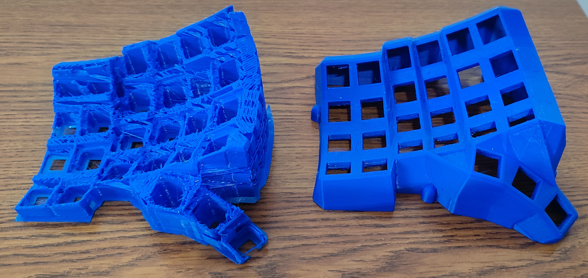
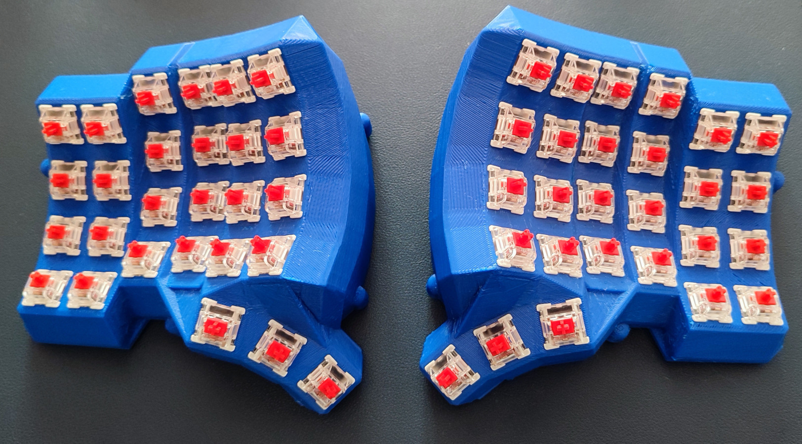
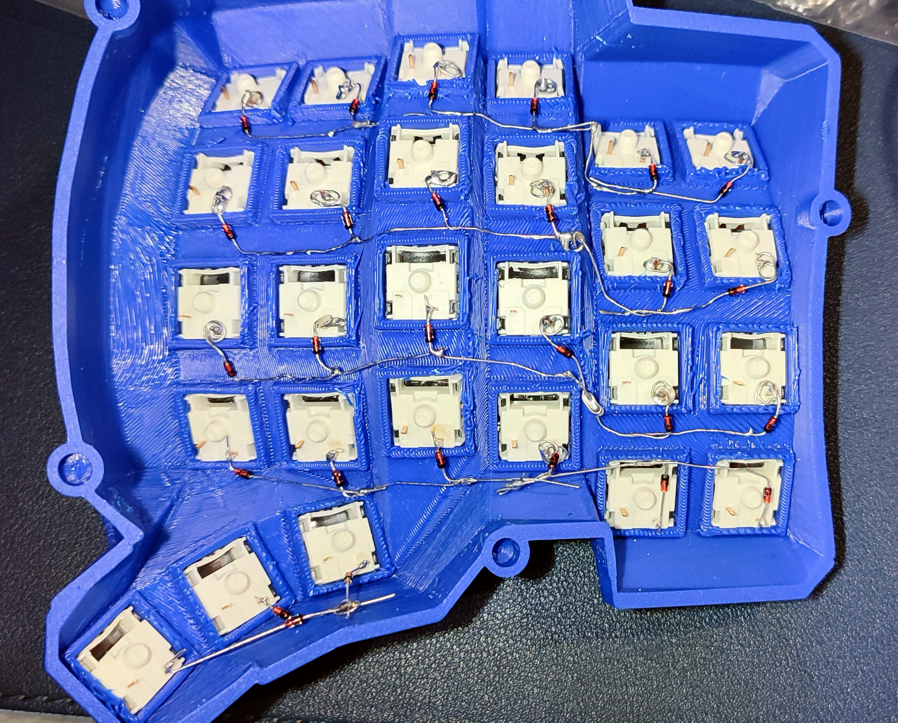
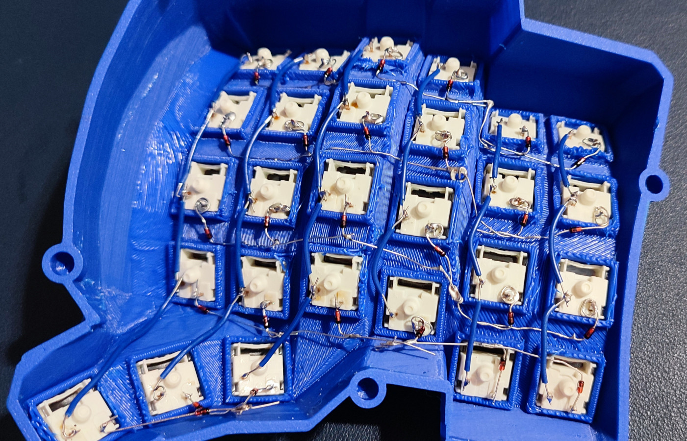
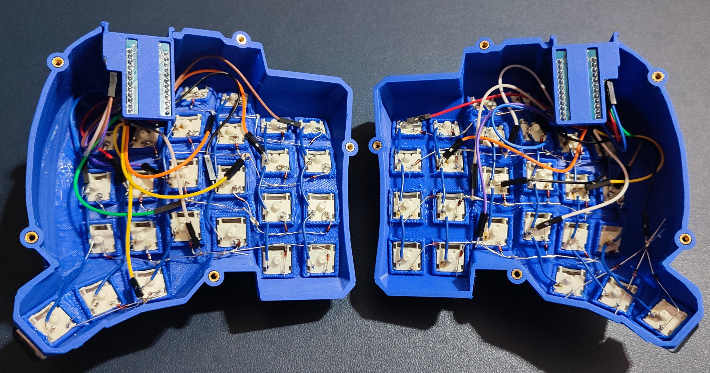
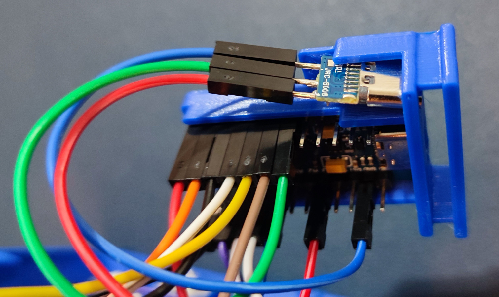
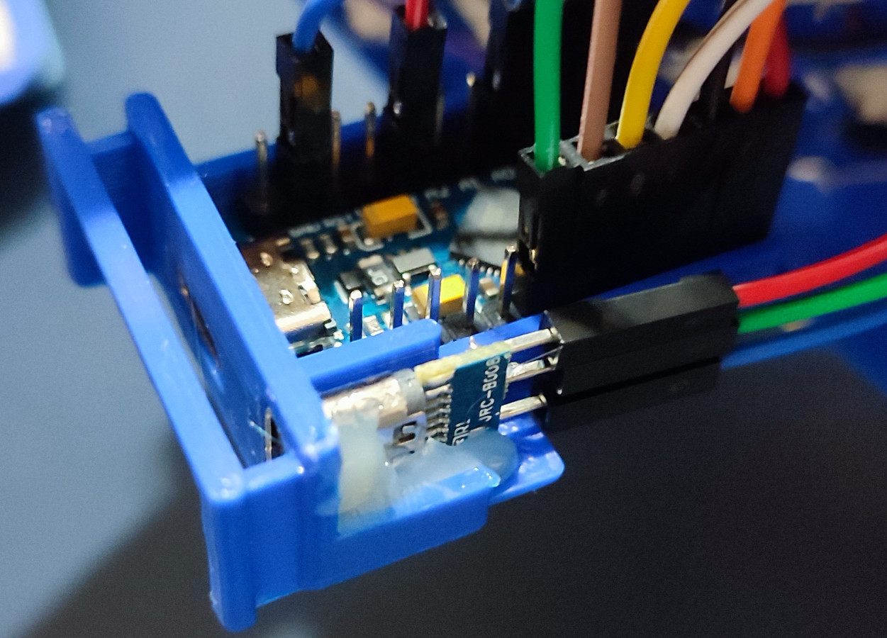
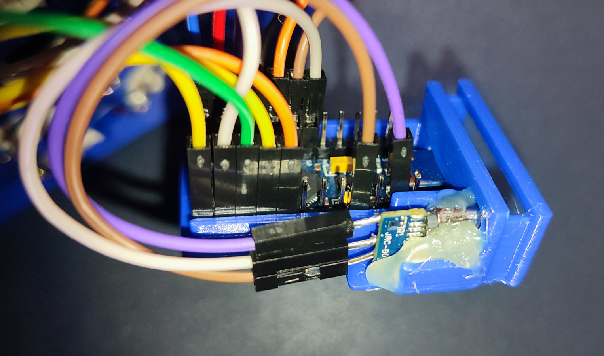
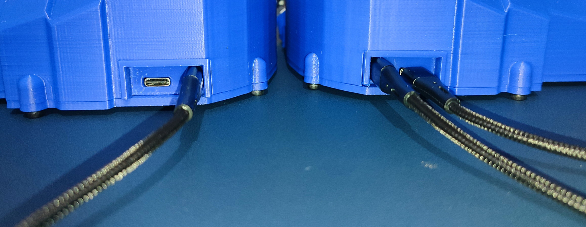
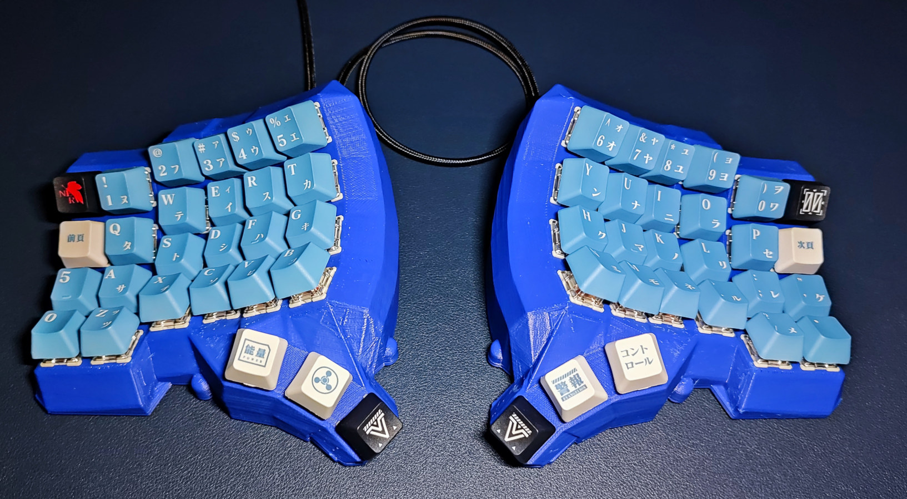

# Dactyl Manuform (5x6) 54

Variant of the [Dactyl-ManuForm](https://github.com/tshort/dactyl-keyboard).
- 54 Keys
- 3 Keys thumb cluster
- External holder for Arduino Pro Micro USB-C
- USB-C for split keyboard communication instead of TRRS
    - The socket is rotated 90 degrees to mark its purpose

## Models
`models` directory include the cases, plates and externals holders
- Cases and plates were generated using [Dactyl Keyboard Configurator](https://ryanis.cool/dactyl/#manuform:CiUIBhAFGgp0aHJlZS1taW5pIgR6ZXJvKgNib3gyBm5vcm1pZTgBEhAIiA4QhAcYwgMgBCi4CDBaGgoIARIEbm9uZRgAIhdVAACAQBgAIAFdAAAAQGUAAABAQABIADL5AZUDAAAAQJ0DAACAP4ADAYgDAQ0AAAAAFQAAAAAdMzMzQCUAAIDALQAAUME1AABAQD0AAAAARQAAAABNAAAgQVUAAEDAXQAAoMBlAABMwm0AAMjBdQAAOMF4nASAAb8WiAHOGJUBAAAcwp0BAAAswqUBAACAwagBnASwAfMXuAHOGMUBAABQws0BAADQwdUBAABAwdgBnATgAfMX6AGQHPUBAAC4wf0BAAAIwoUCAADAwIgChAeQApUQmALKEaUCAAAMwq0CAACAwbUCAAAAwLgChAfAApUQyALKEdUCAABwwd0CAAAgweUCAACgQOgC7AnwAvsH+AKEByoGCAAQABgA)
- External holders were generated using OpenSCAD, source file is included

## Flashing
Symlink this repo into the QMK repository at the path stated below
```bash
git clone https://github.com/ozelentok/dactyl-manuform-5x6-54
git clone --recursive https://github.com/qmk/qmk_firmware
ln -s -r dactyl-manuform-5x6-54/src qmk_firmware/keyboards/handwired/dactyl_manuform/5x6_54
````

Compile and flash each side accordingly
```bash
cd qmk_firmware
qmk compile -kb handwired/dactyl_manuform/5x6_54 -km default
qmk flash -kb handwired/dactyl_manuform/5x6_54 -km default -bl avrdude-split-left
qmk flash -kb handwired/dactyl_manuform/5x6_54 -km default -bl avrdude-split-right
```

## Assembly
### 3D Printed Case, 4h10m print on Kingroon KP3S 3.0 with a 0.6mm CHT volcano nozzle at 120mm/s

### Gateron Pro 3.0 Red Switches

### Soldered IN4148 Diodes as Row Wires

### Soldered 24 AWG Wires as Column Wires

### Dupont Wires Connecting Controller Pins to Rows and Columns

### External Holders with USB-C for Split Keyboard Communication
The USB-C female socket is rotated 90 degrees and is hot glued to the external holder to secure it in-place




### Completed


## License
Copyright © 2015-2023 Matthew Adereth, Tom Short, Oz Elentok
